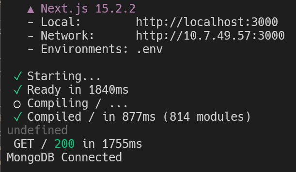

# **Syllabi Reader App Documentation**

## **Improved Front End**

### Color Palette

The first thing we noticed was that our front end of the webpage did not look very good. We did not like the color palette as it look unappealing to the user. We also wanted to learn something new to implement our front end in, so we decided to use 

Researched Appealing Color Palette using this website:

```

https://colorhunt.co/

https://coolors.co/palette/2b2d42-8d99ae-edf2f4-ef233c-d90429

We also used an additional color:

#DAD7CD
```


### Tailwind CSS

We wanted to learn how to make our front end look better by efficiently coding CSS, one of the tools we found was tailwind css. Tailwind uses a set of utility classes, allowing quick development and less writing of code, while maintaining the customization of the webpage.

Tailwind comes with NextJS, which we will talk in depth about later. Here's some example code that we wrote using tailwind:
```
<h1 class="flex justify-self-center text-4xl font-bold my-10">
  Syllabi Reader
</h1>
```

Notice, how it makes the code much more concise than if we were to write it in regular CSS. You can find more code on page.js that uses tailwind.

### NextJS

To make out webpage more scalable, we decided to learn NextJS, we tried to switch our webpage from default JavaScript to a NextJS Application.

We imported the important packages from NextJS:
```
import Image from "next/image";
import Link from "next/link";
```

We also are setting up server side data fetching using this package:

```
import { getPosts } from "@/_actions/postAction";

export default async function Home() {
  const { data, errMsg } = getPosts();
  console.log(data);

```

### Vercel App

(Needs to be Done)

## **Database**

### Setting up a NoSQL Database

Hassan has done SQL in the past, however, he had no idea on how to use NoSQL database management systems, like MongoDB. Therefore, we decided to learn and attempt implementation of a MongoDB database and connect it with our Webpage. 

We learned how to set up MongoDB using this link:

https://www.mongodb.com/developer/languages/javascript/nextjs-with-mongodb/#getting-started-with-mongodb

We used Mongoose library from MongoDB to connect the database

The code that connects the database is written in config/database.js:

```
import mongoose from "mongoose";

const connectDatabase = async () => {
  if (mongoose.connections[0].readyState) {
    return true;
  }
```

o



We have connected and populated the database with tables as following:

```
Student

ID - KEY
EMAIL - UNIQUE
PASSWORD
CLASS
YEAR
SYLLABUSID


Admin

ID
EMAIL
PASSWORD


Syllabi

ID
CLASS
DOCUMENT TYPE
TERM
STUDENTID
FACULTY

```

We have populated the database with emails, usernames and passwords. We also made sure that the passwords are hashed to ensure user security. We also have data about the classes and their respective syllabi, which will allow saving of files in the future.

### Login/SignUp Page

In order to introduce the initial data in our application, we thought that introduction of a login/sign-up page is going to be very useful for experimental purposes. We can use this data to populate out database, and also execute simple get and post methods between our database and webserver. 

We developed a login page, where there are two entry fields. We have login and password. If a user has not already signed up, they will have to put their details in regardless, and then the application will have them sign up. If their data is already in the database, they will be directed to the syllabus reader. If you have already signed up, and your login credentials entry does not match up, the application will not allow you to advance to the PDF Reader.

We used Next JS and the included TailwindCSS, and we also used shadcn/ui
Here's the link to Shadcn Documentation:
```
https://ui.shadcn.com/docs
```


```
import { Button } from "@/components/ui/button"; // Shadcn Component
import { Input } from "@/components/ui/input";
import Link from "next/link";                   // NextJS Link Component
```

## **PDF Text Parser**

### Researching Libraries and Implementation Plan

Here are some libraries that we found on the internet:

```
PDF Parse (PDF obviously)
https://www.npmjs.com/package/pdf-parse

Mammoth (DOCX)
https://www.npmjs.com/package/mammoth

Compromise
https://www.npmjs.com/package/compromise

Date-NFS
https://www.npmjs.com/package/date-fns

iCal Generator
https://www.npmjs.com/package/ical-generator
```

The three most important libraries that we'll use are PDF parse, Compromise, iCal Generator. PDF Parser takes in a range of words or pages, and the parses all that data within the pdf and prints it out allowing it to be manipulated. 

Next, we have Compromise, which classifies the data within the parsed text from the pdf. It will output all the dates and relevant titles from the text. You can also make custom categories like events, so you may be able to extract specific data of our desire. 

Next, we have iCal library, this will allow us to input a .ics file and this will populate our google calender. The .ics file will have all the relevant dates/events in it.

### Actual Implementation

We tried to implement the libraries above, however, Date-NFS and Compromise did not work as they were very outdated.

Instead we used OpenAI API to have our pdf/docx file parsed and be formatted in a specific patten. We paid about $10 balance for the API to function.

We used the following prompt for the AI to parse and format our PDF:

```
From the following syllabus, extract a list of key academic dates (like exams, holidays, deadlines, homework, and assignment due dates). Return it as JSON. Each object must contain:
"title" (e.g., "Homework 1 Due", "Midterm Exam", "Spring Break")
"date" (format: YYYY-MM-DD)
"description" (optional, e.g., "Submit via Canvas by 11:59 PM")
Only return valid ISO date strings like "2025-03-03", not natural language. Syllabus text: ${syllabusText}
````

Once the dates and deadlines are extracted, we have an ability to edit our dates in case there is a slight error by OpenAI API.

### Calendar Population

Once you are done, you can download the .ics file, and then upload it to your Google Calendar. This will populate your calendar, and Boom! You are Done!